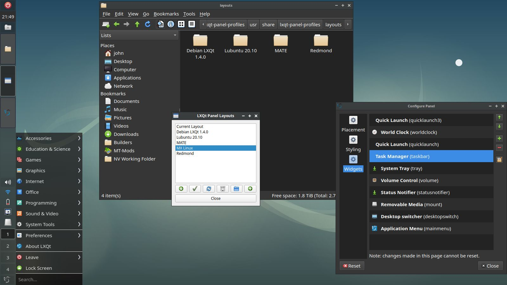
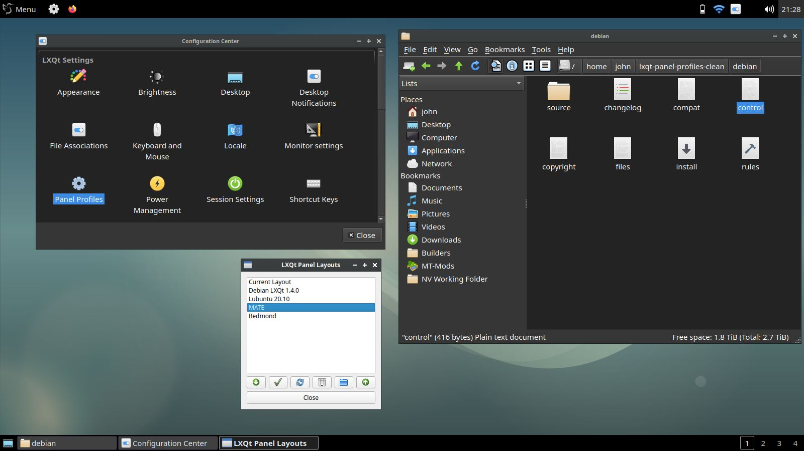
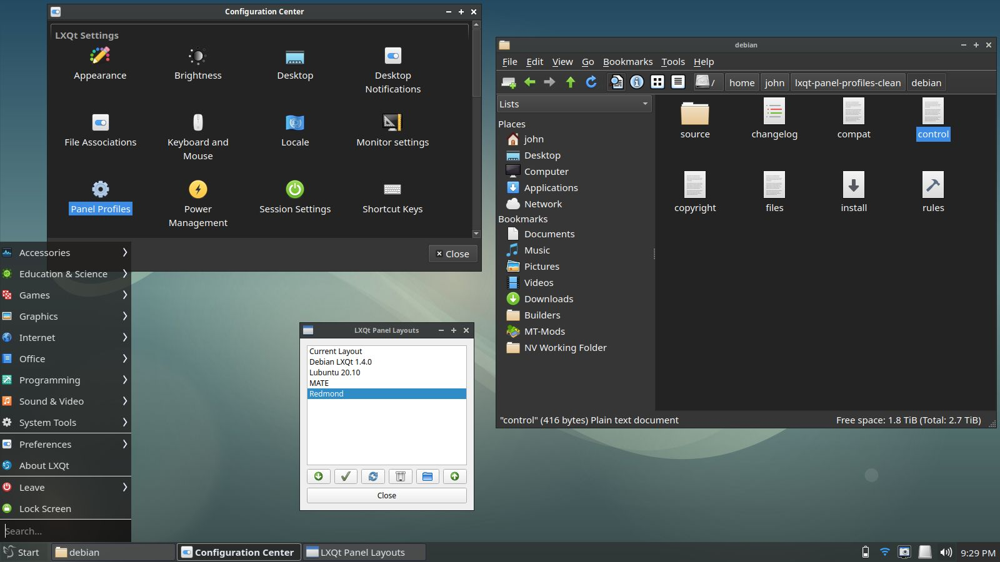

# LXQt Panel Profiles
## About
LXQt Panel Profiles allows to backup, switch, export and import panel configurations.
It is equivalent to XFCE's panel profiles program and behaves very similarly.

## Build the Debian Package (Debian 12 or higher)

```
sudo apt install debhelper
cd lxqt-panel-profiles
dpkg-buildpackage -b
```

This will generate a `.deb` file for the program in the parent directory.
To install the package assuming you are still in `lxqt-panel-profiles` directory:

```
cd ..
sudo apt install ./lxqt-panel-profiles*.deb
```

## Manual Installation

First, install the dependencies on your system.
Note: Some Fedora versions are still using the Qt5 version of LXQt. This will not affect core functionality,
 but it WILL cause LXQt Panel Profiles not following the themes on those systems.

### Fedora 41:
```
sudo dnf install lxqt-panel tar python3-pyqt6 qt6-qdbusviewer
```
### Fedora 40:
```
sudo dnf install lxqt-panel tar python3-pyqt6 qt5-qdbusviewer
```

### Alpine Linux Edge:
```
apk add lxqt-panel tar py3-pyqt6 qt6-qdbusviewer
```

### Arch Linux:
```
sudo pacman -S lxqt-panel tar python-pyqt6 qt6-tools
```

### Then for ALL of them:
```
git clone https://codeberg.org/MrReplikant/lxqt-panel-profiles.git
cd lxqt-panel-profiles
sudo cp -a usr/* /usr/
```

And done!


## Screenshots

### MX Linux


### MATE


### Redmond (win95)

