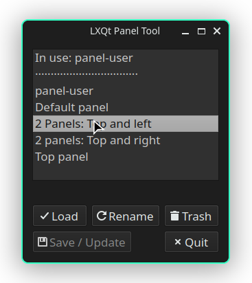

## LXQt Panel Tool

> LXQt Panel Tool creates backups and switches different lxqt-panel configurations.
> It is a fork of https://codeberg.org/MrReplikant/lxqt-panel-profiles.git



### Key Changes

* Simpler UX with less popup messages.
* Update running configuration with alert for unsaved changes.
* Move to trash when deleting configurations.
* Added translations.
* Text buttons.
* Added support for .rpm based distributions.
* Load default configuration, example layouts shipped.
* Sharing and archiving has been removed.

For the saved configurations the same directory (`~/.local/share/lxqt-panel-profiles`) is used.

## Installation

### Arch Linux and derivatives

Install the [AUR package](https://aur.archlinux.org/packages/lxqt-panel-tool)

### Debian, derivatives
```apt
# apt -y install lxqt-panel python3-pyqt6 qdbus-qt6
```
### Fedora
```
# dnf install lxqt-panel python-pyqt6 qt6-qttools
```
### openSuse
```
zypper install lxqt-panel python-PyQt6 qt6-qttools
```
Installation as user (to `~/bin` → has to be in your `$PATH`) or systemwide:

```bash
git clone https://github.com/stefonarch/lxqt-panel-tool /tmp/
cd /tmp/lxqt-panel-tool
chmod a+x install.sh
./install.sh
```


